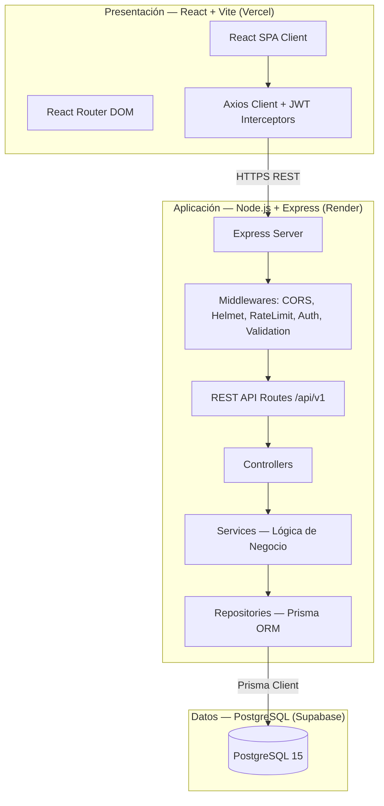
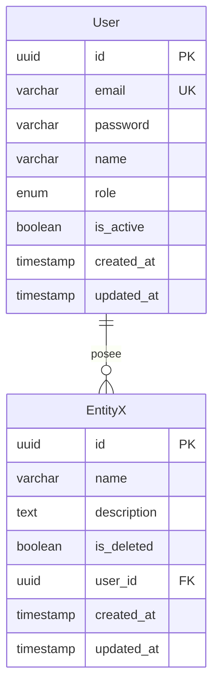

# Skill — Mermaid Diagram Generator (Software Architecture)

## Propósito
Guiar al Agente Arquitecto sobre cómo generar los cuatro diagramas obligatorios de la PC2 en formato Mermaid.js e inyectarlos con precisión dentro de `/docs/informe-pc2.md`.

## Catálogo de Diagramas Obligatorios

### 1. Diagrama de Casos de Uso (Left-to-Right)
Debe modelar de forma exhaustiva los actores primarios (humanos), secundarios (APIs externas) y todos los casos de uso principales.

```mermaid
graph LR
    subgraph Actores
        U([👤 Usuario Final])
        A([👤 Administrador])
        S([🤖 Supabase / API])
    end

    subgraph Sistema "[Nombre del Sistema]"
        UC1(Registrar Transacción)
        UC2(Consultar Historial)
        UC3(Administrar Roles)
        UC4(Generar Reportes)
    end

    U --> UC1
    U --> UC2
    A --> UC3
    A --> UC4
    UC4 -.->|"<<include>>"| UC2
    UC1 -.->|"<<include>>"| S
```

### 2. Diagrama de Arquitectura Lógica (Capas Estrictas)
Muestra la separación de responsabilidades: Presentación, Aplicación y Datos.



### 3. Diagrama de Arquitectura Física en Nube (SRE/DevSecOps)
Muestra el flujo de CI/CD e infraestructura.

```mermaid
graph TB
    subgraph Cliente
        USER[🌐 Usuario Final]
    end

    subgraph "Control de Versiones y CI/CD"
        GIT[📁 GitHub Repositorio]
        ACTIONS[⚙️ GitHub Actions CI/CD]
    end

    subgraph "Nube Vercel"
        FE[🌍 React Build - CDN Global]
    end

    subgraph "Nube Render"
        BE[🖥️ Express Web Service]
    end

    subgraph "Nube Supabase"
        DB[(🐘 PostgreSQL 15)]
    end

    USER -->|HTTPS| FE
    FE -->|REST HTTPS| BE
    BE -->|Connection Pool (SSL/TLS)| DB
    GIT --> ACTIONS
    ACTIONS -->|Deploy Hook| BE
    ACTIONS -->|Git Push Deploy| FE
```

### 4. Diagrama de Modelo Entidad-Relación (ER - 3FN)
Modelo de datos relacional detallado utilizando tipos nativos de PostgreSQL.


