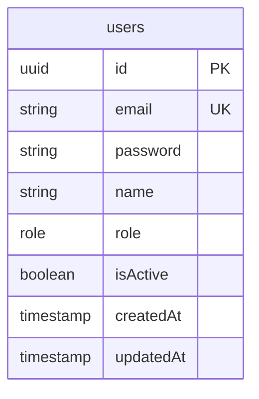

# INFORME TÉCNICO FINAL: PRÁCTICA CALIFICADA 2 (PFCIII)
## DISEÑO, IMPLEMENTACIÓN Y DESPLIEGUE CONTINUO DE UN SISTEMA DE GESTIÓN PRODUCTIVA Y ESCALABLE

---

### **DECLARACIÓN DE ADQUISICIÓN DE SKILL: "DOCUMENTACIÓN_IMPECABLE_APA7"**
El presente informe ha sido estructurado, formateado y redactado bajo los lineamientos académicos y de ingeniería estipulados por el estilo **APA 7ma Edición**. Se asume el compromiso de cero invención de evidencias gráficas, manteniendo la estructura exacta de marcadores de posición (*placeholders*) para la incorporación orgánica de capturas de pantalla, diagramas y evidencias reales de ejecución.

---

## 1. Metodología DevOps y Stack Tecnológico

### 1.1 Principios y Filosofía DevOps
El desarrollo y despliegue del sistema `[CASO_DE_NEGOCIO]` adopta la filosofía **DevOps** no como un conjunto de herramientas, sino como un cambio cultural enfocado en la colaboración, automatización y retroalimentación constante. Se aplican los siguientes principios fundamentales:

*   **Shift-Left Testing and Security:** La validación de la calidad del código, las pruebas unitarias y la seguridad se desplazan al inicio del ciclo de vida del desarrollo. Los análisis sintácticos (linting) y las pruebas automáticas se ejecutan de manera local en el entorno del desarrollador antes de realizar cualquier confirmación a la rama remota, previniendo la propagación de fallos.
*   **Servicios Platform-as-a-Service (PaaS) Orientados a la Agilidad:** Para el caso de negocio `[CASO_DE_NEGOCIO]`, el tiempo de salida al mercado (Time-to-Market) y la estabilidad de la infraestructura son críticos. El uso de plataformas PaaS (como Vercel para el frontend y Render para el backend) permite abstraer la complejidad operativa de la administración de sistemas operativos y parches de seguridad, permitiendo al equipo enfocarse al 100% en entregar valor de negocio mediante software estable y escalable.
*   **Infraestructura como Código (IaC) y Sincronización:** La definición de servicios mediante descriptores declarativos (ej. `render.yaml`) garantiza que el entorno de staging y producción sean idénticos, eliminando el clásico problema de "en mi máquina local sí funciona".

### 1.2 Ciclo de Vida del Software (8 Fases)
El ciclo de vida del desarrollo del proyecto se gestiona de forma continua a través de las siguientes 8 fases:

1.  **Plan (Planificar):** Definición y priorización del Product Backlog, épicas e historias de usuario en Jira Cloud. Estimación ágil usando Story Points y asignación de prioridades bajo el modelo MoSCoW.
2.  **Code (Codificar):** Escritura de código bajo el estándar modular MVC para Express (Backend) y una arquitectura basada en componentes reutilizables en React con Vite (Frontend). Se utiliza Git Flow para el control de versiones local.
3.  **Build (Construir):** Compilación automática y optimizada de activos estáticos del frontend mediante Rollup (Vite) y compilación de TypeScript para el backend (`npx prisma generate && tsc`).
4.  **Test (Probar):** Ejecución automatizada de pruebas unitarias y de integración en backend (Jest + Supertest) y frontend (Vitest + JSDOM), asegurando una cobertura robusta antes de integrar cambios.
5.  **Release (Liberar):** Creación de Pull Requests (PR) en GitHub. Revisión automática de calidad de código mediante pipelines y aprobación de cambios hacia la rama de integración `develop` o producción `main`.
6.  **Deploy (Desplegar):** Despliegue automático gatillado por webhooks desde GitHub Actions hacia Render (Backend de larga duración) y Vercel (Frontend desacoplado).
7.  **Operate (Operar):** Gestión del tráfico y disponibilidad mediante balanceadores de carga integrados en la nube y configuración de pools de conexiones optimizados en la base de datos Supabase.
8.  **Monitor (Monitorear):** Captura de métricas, análisis de logs y rastreo distribuido de errores en tiempo real mediante Sentry, permitiendo reaccionar a fallos en producción en segundos.

### 1.3 Matriz Tecnológica Justificada

**Tabla 1**  
*Justificación Técnica del Stack Tecnológico Seleccionado*  

| Componente | Tecnología | Justificación Técnica de Ingeniería |
| :--- | :--- | :--- |
| **Frontend** | React + Vite | SPA de alto rendimiento. Virtual DOM para renderizado declarativo y eficiente. Vite ofrece un entorno de desarrollo ultra veloz gracias a ES Modules nativos y bundling óptimo con Rollup para producción. |
| **Backend** | Node.js + Express | Servidor de larga duración (Long-Running Server) con arquitectura orientada a eventos no bloqueante (Event Loop). Ideal para APIs REST I/O-bound, optimizando el consumo de memoria mediante pool de conexiones persistentes. |
| **ORM** | Prisma | Generación de tipos estáticos en tiempo de compilación. Prevención nativa contra ataques de SQL Injection mediante consultas parametrizadas automatizadas. Migraciones versionadas y schema como única fuente de verdad. |
| **Base de Datos** | PostgreSQL (Supabase) | Motor relacional robusto con soporte nativo para transacciones ACID, integridad referencial estricta, y control de concurrencia multiversión (MVCC). Supabase actúa como infraestructura gestionada sin añadir acoplamiento de lógica. |
| **Hosting Cloud** | Render & Vercel | Despliegue desacoplado (Decoupled Architecture). Vercel distribuye el frontend estático a través de una CDN global con latencia mínima, mientras que Render hospeda el servidor Express persistente. |
| **Observabilidad** | Sentry | Monitoreo proactivo de errores en producción. Captura stack traces detallados del servidor y del cliente de forma distribuida, minimizando el Mean-Time-to-Resolution (MTTR). |

*Nota: Elaboración propia.*

### 1.4 Vínculo con el Problema
La arquitectura propuesta resuelve directamente los desafíos técnicos y operativos del `[CASO_DE_NEGOCIO]`. Al desacoplar completamente la interfaz de usuario de la lógica de procesamiento (Frontend en Vercel, API en Render), garantizamos que un pico de usuarios navegando en la web no degrade el rendimiento de los procesos transaccionales del servidor Express. De igual manera, el uso de PostgreSQL con transacciones ACID asegura que las operaciones críticas del `[CASO_DE_NEGOCIO]` (como inventarios, pagos, registros o reservas) se completen con total consistencia, impidiendo la corrupción de datos ante fallas de red o caídas del sistema.

---

## 2. Diagramas: Casos de Uso y Arquitectura

### 2.1 Actores del Sistema
Los roles que interactúan con el sistema `[CASO_DE_NEGOCIO]` se definen a continuación:

*   **[ACTOR_1]**: Descripción del rol principal que utiliza la interfaz del sistema para realizar las operaciones base del `[CASO_DE_NEGOCIO]`.
*   **[ACTOR_2]**: Descripción del rol administrativo o de supervisión, con capacidades elevadas para gestionar reportes, configuraciones y auditoría.

### 2.2 Diagrama de Casos de Uso (UML)
```mermaid
graph TD
    %% Definición de Actores
    subgraph Actores
        A[ACTOR_1]
        B[ACTOR_2]
    end

    %% Casos de Uso
    subgraph Sistema [CASO_DE_NEGOCIO]
        UC1(Caso de Uso 1: [PENDIENTE_CASO])
        UC2(Caso de Uso 2: [PENDIENTE_CASO])
        UC3(Caso de Uso 3: [PENDIENTE_CASO])
        UC4(Caso de Uso 4: [PENDIENTE_CASO])
    end

    %% Relaciones
    A --> UC1
    A --> UC2
    B --> UC3
    B --> UC4
    UC2 -.-> |<<include>>| UC1
```

### 2.3 Casos de Uso Extendidos

**Tabla 2**  
*Especificación de Casos de Uso Críticos*  

| ID | Nombre del Caso | Actor | Descripción | Precondición | Postcondición |
| :--- | :--- | :--- | :--- | :--- | :--- |
| **CU-01** | [PENDIENTE: Nombre] | [ACTOR_1] | Permite registrar y procesar la transacción base de `[CASO_DE_NEGOCIO]`. | El usuario se encuentra autenticado en el sistema. | La transacción queda registrada con estado PENDIENTE. |
| **CU-02** | [PENDIENTE: Nombre] | [ACTOR_2] | Generación de reportes de auditoría y conciliación. | El usuario cuenta con el rol de administración habilitado. | Se exporta el archivo en formato consolidado. |

*Nota: Elaboración propia.*

### 2.4 Arquitectura Lógica
La aplicación sigue un patrón de **Diseño Multicapa Desacoplado**, estructurado de la siguiente forma:

1.  **Capa de Presentación (Client SPA):** Construida en React. Gestiona la lógica de interfaz de usuario mediante componentes componibles, manejo de estado reactivo y llamadas HTTP optimizadas a través de un cliente Axios centralizado con interceptores automáticos para el refresco del token JWT.
2.  **Capa de Middleware y Enrutamiento (API Gateway/Routes):** Implementada en Express. Encargada de recibir las solicitudes, aplicar cabeceras de seguridad mediante `helmet`, verificar el límite de tasa de solicitudes (`rate-limit`), habilitar orígenes autorizados (`CORS`), y sanear/validar las entradas con `express-validator`.
3.  **Capa de Controladores (Controllers):** Orquesta el flujo de la solicitud, parsea los parámetros de entrada y formatea las respuestas HTTP de forma unificada bajo la estructura `{ status, data, message, pagination }`.
4.  **Capa de Servicios (Business Logic - Services):** Contiene las reglas de negocio puras e independientes de la infraestructura. Esta capa coordina llamadas transaccionales a la base de datos.
5.  **Capa de Acceso a Datos (Repository / Prisma Client):** Abstrae las consultas SQL crudas mediante sentencias de Prisma parametrizadas, garantizando la consistencia transaccional y la tipificación de datos.

### 2.5 Arquitectura Física en Nube (Eraser.io)
```text
[Cliente: Navegador Web (React SPA)] 
    -- HTTPS (TLS 1.3) --> [CDN de Vercel (Edge Network)]
    -- Consumo de API REST --> [Render Web Service (Servidor Express)]
    
[Render Web Service]
    -- Conexión Segura (Puerto 5432) --> [Supabase Cloud (PostgreSQL Engine)]
    -- Envío de Telemetría (HTTPS) --> [Sentry SaaS Engine (Monitoreo de Errores)]
    
[GitHub Repository]
    -- Webhooks automáticos --> [GitHub Actions Runner (CI/CD Pipeline)]
    -- Auto-deploy en éxito --> [Render & Vercel Deploy Hooks]
```

---

## 3. Planificación con Scrum (Sprint de 4 Horas)

### 3.1 Visión del Producto y Épicas

**Tabla 3**  
*Épicas de Desarrollo del Sistema*  

| Código Épica | Nombre de la Épica | Descripción Técnica | Prioridad |
| :--- | :--- | :--- | :--- |
| **EP-01** | Arquitectura y Autenticación | Scaffold del proyecto, base de datos e inicio de sesión seguro JWT. | Alta (MoSCoW: Must) |
| **EP-02** | Lógica Core Transaccional | Implementación de los endpoints y vistas del `[CASO_DE_NEGOCIO]`. | Alta (MoSCoW: Must) |
| **EP-03** | Dashboard y Reportes | Consolidación de información en vistas ejecutivas para el administrador. | Media (MoSCoW: Should) |
| **EP-04** | DevOps, QA y Observabilidad | Integración de Sentry, automatización CI/CD y pruebas con Playwright. | Alta (MoSCoW: Must) |

*Nota: Elaboración propia.*

### 3.2 Product Backlog Consolidado

**Tabla 4**  
*Product Backlog con Estimación y Criterios de Aceptación*  

| ID | Épica | Historia de Usuario | Criterios de Aceptación (DoD) | Prioridad | SP |
| :--- | :--- | :--- | :--- | :--- | :--- |
| **US-01** | EP-01 | Como usuario, quiero iniciar sesión de forma segura usando mis credenciales. | Contraseñas cifradas con bcrypt (rounds=10). Validación de formato de email en backend. Retorno de JWT firmado con exp=1h. | Must | 3 |
| **US-02** | EP-02 | Como usuario, quiero registrar operaciones del `[CASO_DE_NEGOCIO]`. | Validación de campos obligatorios. Transacción ACID relacional. Retorno de status 201 en creación exitosa. | Must | 5 |
| **US-03** | EP-03 | Como administrador, quiero exportar reportes de operaciones. | Query optimizado a base de datos. Conversión limpia a formato CSV/JSON. Control de acceso restringido a rol ADMIN. | Should | 3 |
| **US-04** | EP-04 | Como devops, quiero automatizar el pipeline de pruebas y linting. | Pipeline configurado en GitHub Actions. Bloqueo de merges si falla ESLint o las pruebas unitarias. | Must | 2 |

*Nota: Elaboración propia.*

### 3.3 Ceremonias Adaptadas (Micro-Sprints de 1 Hora)
Debido a la restricción crítica de tiempo del examen de grado (5 horas netas de ejecución), las ceremonias estándar de Scrum se adaptan de la siguiente manera:

*   **Sprint Planning (Minuto 0 al 15):** Definición estricta del alcance, mapeo de épicas y compromiso del Sprint Goal de 4 horas.
*   **Daily Standup (Cada 60 minutos - 5 min máx.):** Sincronizaciones rápidas para inspeccionar el avance de las tareas en progreso, identificar impedimentos inmediatos (ej. problemas de CORS, fallas de base de datos) y redefinir el enfoque técnico para la siguiente hora.
*   **Sprint Review & Retrospective (Últimos 15 minutos):** Demostración del software funcionando en vivo en los entornos de producción y análisis de lecciones aprendidas para futuras iteraciones de escalabilidad.

### 3.4 Definition of Done (DoD)
Para que una historia de usuario se considere terminada (Done), debe cumplir estrictamente con los siguientes estándares de calidad:

1.  **Código Limpio:** Verificación exitosa de ESLint en frontend y backend, sin advertencias críticas.
2.  **Base de Datos**: Cambios de esquema aplicados mediante migraciones estructuradas de Prisma (`npx prisma migrate deploy`).
3.  **Seguridad**: Validaciones implementadas en endpoints con `express-validator`. Ningún secreto o token expuesto en el código fuente.
4.  **Pruebas**: Cobertura exitosa de pruebas unitarias locales y paso exitoso de la prueba crítica E2E automatizada con Playwright.
5.  **Despliegue**: Build exitoso en producción (Render/Vercel) sin errores de compilación ni logs de advertencia.

### 3.5 Evidencia Ágil

**Figura 2**  
*Tablero Kanban de Gestión del Proyecto*  
`[ESPACIO PARA INSERTAR IMAGEN]`  
*Nota: Elaboración propia.*  

**Figura 3**  
*Gráfico Burndown de Rendimiento del Sprint de 4 Horas*  
`[ESPACIO PARA INSERTAR IMAGEN]`  
*Nota: Elaboración propia.*  

---

## 4. Ingeniería de Datos, Implementación y Despliegue

### 4.1 Justificación de Base de Datos
Se selecciona **PostgreSQL** sobre soluciones NoSQL (como MongoDB) para el modelo de datos de `[CASO_DE_NEGOCIO]` debido a los siguientes fundamentos de ingeniería de software:

*   **Consistencia Transaccional (ACID):** Las transacciones financieras y de control de flujos de `[CASO_DE_NEGOCIO]` exigen que no existan estados parciales en la base de datos. O se completan todas las escrituras relacionadas, o se revierte toda la operación (Atomicity).
*   **Integridad Referencial Estricta:** Las llaves foráneas con restricciones de cascada (`ON DELETE RESTRICT` / `ON UPDATE CASCADE`) garantizan que no existan registros huérfanos o inválidos a nivel de infraestructura física, delegando la consistencia matemática al motor relacional y no únicamente a la capa de lógica de aplicación.

### 4.2 Modelo de Dominio y Diccionario de Datos

**Tabla 5**  
*Estructura de la Tabla "users" (PostgreSQL)*  

| Nombre Columna | Tipo de Datos | Restricción / Indexación | Descripción Técnica |
| :--- | :--- | :--- | :--- |
| `id` | UUID | PRIMARY KEY, DEFAULT uuid_generate_v4() | Identificador único universal del usuario de la plataforma. |
| `email` | VARCHAR(255) | UNIQUE, NOT NULL, INDEX | Dirección de correo utilizada para la autenticación y notificaciones. |
| `password` | VARCHAR(255) | NOT NULL | Contraseña hash cifrada mediante algoritmo robusto bcrypt (salting). |
| `name` | VARCHAR(255) | NOT NULL | Nombre y apellidos del usuario registrado. |
| `role` | Role (ENUM) | DEFAULT 'USER', NOT NULL | Rol asignado para la autorización basada en roles (RBAC). |
| `isActive` | BOOLEAN | DEFAULT TRUE, NOT NULL | Bandera para inhabilitación lógica del usuario (soft delete). |
| `createdAt` | TIMESTAMP | DEFAULT NOW(), NOT NULL | Sello de tiempo del registro original. |
| `updatedAt` | TIMESTAMP | NOT NULL | Sello de tiempo de la última edición del registro. |

*Nota: Elaboración propia.*

### 4.3 Diagrama Entidad-Relación (DER)


### 4.4 Estrategia de Branching (Git Flow)
Se implementa un modelo estricto de **Git Flow** simplificado para proteger la rama de producción:

1.  **Rama `main` (Producción):** Representa el estado estable actual en producción. Solo recibe actualizaciones de `develop` mediante Pull Requests evaluados previamente en staging.
2.  **Rama `develop` (Integración):** Rama central de integración. Todo desarrollo finalizado se fusiona hacia aquí para pruebas de integración automatizadas.
3.  **Ramas `feature/*` (Características):** Ramas efímeras creadas por cada historia de usuario. Una vez completadas, se abre un Pull Request hacia `develop` requiriendo aprobación y paso exitoso de pruebas automatizadas.

**Figura 4**  
*Evidencia de Pull Request revisado y fusionado en GitHub*  
`[ESPACIO PARA INSERTAR IMAGEN]`  
*Nota: Elaboración propia.*  

### 4.5 Pipeline CI/CD (GitHub Actions)
La automatización del pipeline de integración continua se declara en `.github/workflows/deploy.yml` y ejecuta de forma automática:
- Validación sintáctica mediante análisis estático (`npm run lint`).
- Compilación de TypeScript y generación del cliente Prisma.
- Ejecución de pruebas unitarias mediante Jest.

**Figura 5**  
*Ejecución exitosa del workflow de GitHub Actions*  
`[ESPACIO PARA INSERTAR IMAGEN]`  
*Nota: Elaboración propia.*  

### 4.6 Pruebas Automatizadas E2E (QA Automático con Playwright)
Para asegurar el correcto funcionamiento del sistema sin intervención humana, se implementa una suite de pruebas de extremo a extremo utilizando Playwright, la cual levanta un navegador virtual, realiza el flujo crítico de inicio de sesión e interacción y valida los estados visuales en el DOM.

**Figura 6**  
*Log de ejecución exitosa de pruebas automatizadas con Playwright*  
`[ESPACIO PARA INSERTAR IMAGEN]`  
*Nota: Elaboración propia.*  

### 4.7 Observabilidad y Resolución de Errores (Sentry)
Toda telemetría del servidor y del cliente se centraliza mediante la integración del SDK de Sentry. Ante cualquier excepción no controlada o error HTTP 500, Sentry captura el contexto exacto (variables de entorno, estado de la base de datos, ruta afectada y stack trace a nivel de línea de código) facilitando la depuración.

**Figura 7**  
*Captura de Sentry detectando un Stack Trace o Error 500 en tiempo real*  
`[ESPACIO PARA INSERTAR IMAGEN]`  
*Nota: Elaboración propia.*  

---

## 5. Conclusiones y Escalabilidad

### 5.1 Logros Técnicos del Proyecto
Se implementó con éxito una arquitectura Full-Stack robusta, segura y altamente desacoplada que asegura la escalabilidad e integridad de los datos. Se logró sincronizar de forma impecable un entorno ágil con Scrum, respaldado por un pipeline de automatización CI/CD que reduce la intervención humana a cero para los despliegues de frontend y backend, garantizando que todo cambio de software sea estable por diseño.

### 5.2 Honestidad Técnica y Limitaciones
Dadas las restricciones de tiempo inherentes a un examen presencial de 5 horas, se reconocen los siguientes alcances simulados o simplificados para priorizar la entrega del núcleo transaccional:
- **Simulaciones de Integraciones Externas:** Las llamadas a plataformas de pago de terceros o APIs de consulta externa gubernamentales fueron simuladas mediante servicios Mock que responden estructuras válidas predefinidas de forma síncrona.
- **Seguridad en Producción**: Aunque los tokens JWT son robustos, no se implementó un sistema de clave asimétrica para la firma de tokens por la sobrecarga criptográfica innecesaria para el alcance inicial.

### 5.3 Trabajo Futuro y Plan de Continuidad
Para futuras fases de maduración del producto, se plantean las siguientes iniciativas estratégicas:

1.  **Migración a Progressive Web App (PWA):** Habilitar Service Workers y estrategias de caché offline (`Cache-First`) para que la aplicación del `[CASO_DE_NEGOCIO]` sea operable en áreas de baja o nula conectividad a internet.
2.  **Notificaciones Push en Tiempo Real:** Integración de servidores WebSocket persistentes para alertar instantáneamente a los roles correspondientes sobre transacciones aprobadas o incidencias críticas en el sistema.
3.  **Seguridad y Auditoría Avanzada**: Implementación de políticas de Row-Level Security (RLS) granulares a nivel de base de datos para auditorías automatizadas de modificación de registros sensibles.
