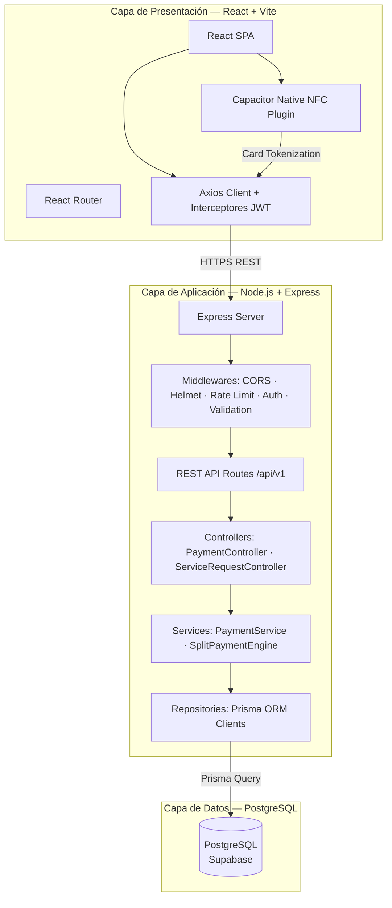
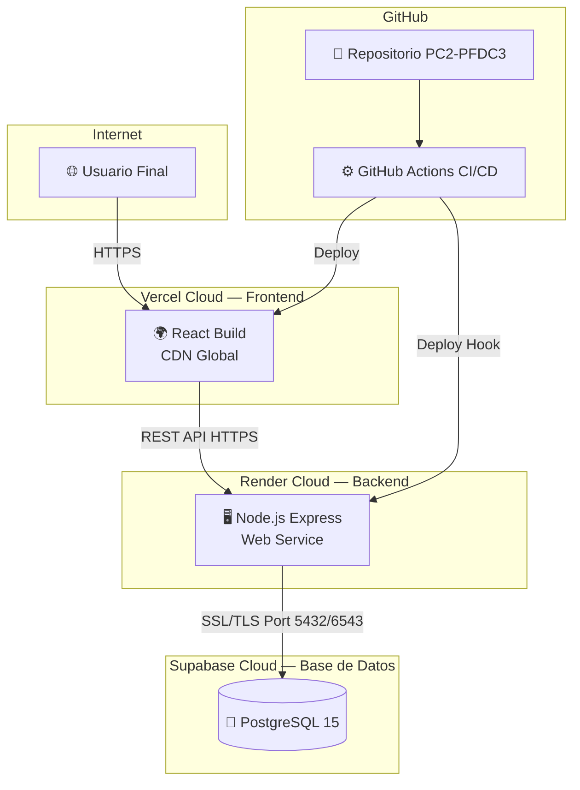
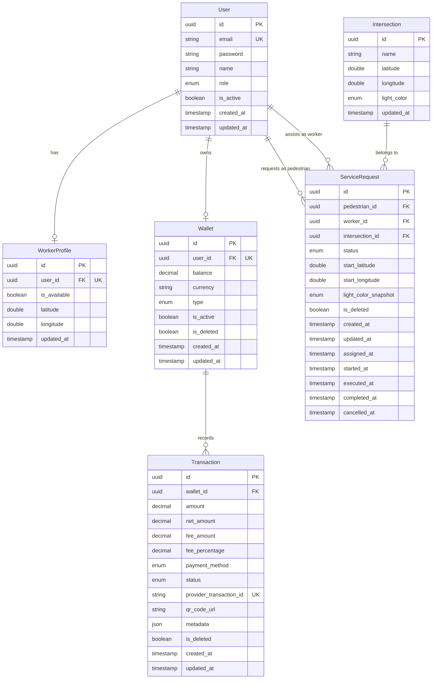
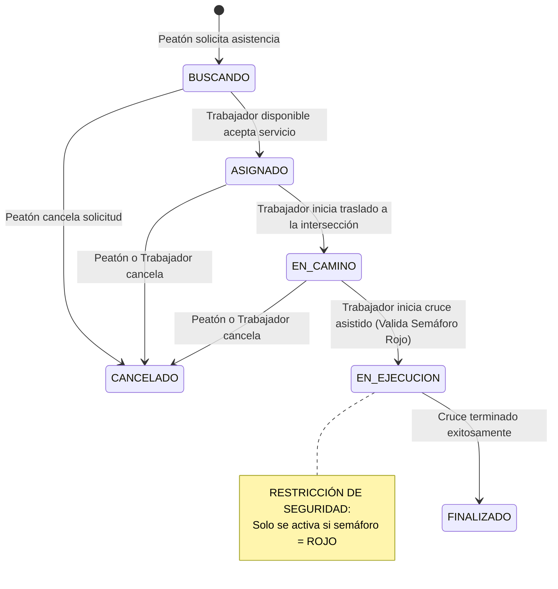

# Informe Técnico PC2 — Semáforo Social (Plataforma On-Demand & Fintech)

> **Curso:** Proyecto de Fin de Carrera / Ingeniería de Software II  
> **Docente:** Profesor de Cátedra  
> **Grupo:** Grupo de Desarrollo Agéntico SRE  
> **Integrantes:** Equipo de Desarrollo SRE  
> **Fecha de Entrega:** 25/06/2026  
> **Repositorio:** [https://github.com/EdwinFlores19/PC2-Boilerplate-Puente](https://github.com/EdwinFlores19/PC2-Boilerplate-Puente)  
> **URL del Sistema en Producción:** [https://semaforo-social.onrender.com](https://semaforo-social.onrender.com)

---

## 1. Metodología DevOps y Stack Tecnológico

### 1.1 Metodología DevOps Adoptada

La metodología DevOps adoptada para el proyecto "Semáforo Social" integra prácticas avanzadas de automatización, integración continua, despliegue continuo (CI/CD) y orquestación agéntica de Inteligencia Artificial para alcanzar un modelo operativo de alta resiliencia y disponibilidad ("Zero-Breakage"). Bajo este marco, se implementaron las siguientes dimensiones de ingeniería de software:

1. **Gestión de Backlog y Planificación Ágil:** Empleo del marco de trabajo ágil Scrum con sprints de dos semanas y una velocidad de equipo estimada de 41 puntos de historia. El backlog del producto se priorizó y estructuró en Jira Cloud mediante la automatización de scripts en Python que mapean las épicas e historias de usuario (US) directamente desde la especificación técnica.
2. **Estrategia de Branching (Git Flow):** Para asegurar la estabilidad y el control del ciclo de vida del software, se adoptó el estándar Git Flow:
   - `main`: Rama de producción altamente protegida. No acepta pushes directos, requiere la aprobación de Pull Requests (PR) y la validación en verde de los pipelines.
   - `develop`: Rama de staging e integración donde se consolidan las funcionalidades validadas de los desarrolladores antes de su paso a producción.
   - `feature/*` y `hotfix/*`: Ramas temporales de desarrollo de nuevas características o resolución de bugs críticos que se fusionan a `develop` o `main` respectivamente mediante PRs validados.
3. **Integración Continua (CI):** Implementación de pipelines automatizados en GitHub Actions (`.github/workflows/deploy.yml`) que se activan con cada push o fusión hacia `develop` o `main`. El pipeline realiza las tareas de comprobación de código estático (ESLint), validación de tipos en TypeScript (`tsc`), ejecución de pruebas unitarias y de integración (Jest en backend con Supertest, y Vitest en frontend) y la compilación de producción de React con Vite, bloqueando la integración de cualquier código que introduzca fallas.
4. **Entrega y Despliegue Continuo (CD):** El sistema automatiza el despliegue a la nube tras la superación exitosa de la suite de pruebas. El backend en Express se despliega automáticamente en **Render** como un Web Service de larga duración, mientras que la SPA de React se distribuye en la red global de entrega de contenido (CDN) de **Vercel**, asegurando tiempos de carga mínimos y alta disponibilidad.
5. **Orquestación Agéntica IA:** Adopción de un ecosistema interno de agentes de IA especializados que actúan como un enjambre de desarrollo (Scrum Master, Arquitecto, DevOps, Backend DBA), operando con herramientas MCP (Model Context Protocol) para realizar validaciones cruzadas, pruebas automatizadas en navegadores mediante Playwright y auditorías del sistema antes de cada liberación.

### 1.2 Justificación del Stack Tecnológico

#### Backend: Node.js con Express
La selección de Node.js como motor de ejecución para la API REST del backend se fundamenta en su modelo de concurrencia basado en un **Event Loop de un solo hilo con I/O no bloqueante** (construido sobre la biblioteca de bajo nivel `libuv`). 

Para una plataforma "tipo Uber" como "Semáforo Social", el backend debe gestionar una alta concurrencia de conexiones simultáneas provenientes de peatones solicitando cruces y trabajadores enviando sus coordenadas de geolocalización en tiempo real. En un servidor tradicional multi-hilo, cada request bloquearía un hilo del sistema operativo esperando la respuesta de la base de datos, lo que escalaría exponencialmente el consumo de memoria. Node.js delega las operaciones de I/O de la base de datos (Supabase) al pool de hilos de `libuv`, permitiendo que el hilo principal siga atendiendo nuevas peticiones con un consumo de recursos sumamente bajo y predecible.

Express.js se justifica por ser un framework minimalista de alta madurez que ofrece un router y un sistema de middlewares robusto, lo que nos permite implementar un patrón arquitectónico limpio (MVC de Router → Controller → Service → Repository) de forma explícita, y asegurar la API con middlewares estandarizados como `helmet` (para cabeceras HTTP de seguridad), `cors` (para control de orígenes permitidos) y `express-rate-limit` (para mitigar ataques DoS).

#### Base de Datos: PostgreSQL (vía Supabase)
El modelo de negocio de "Semáforo Social" maneja datos altamente relacionales y transacciones críticas en su capa Fintech (billeteras digitales, pagos por Yape/Plin/NFC, cálculo de comisiones e impuestos NRUS). Estas operaciones exigen garantías **ACID** (Atomicidad, Consistencia, Aislamiento y Durabilidad) estrictas que prevengan fallas como el doble gasto de saldo o la inconsistencia en el historial de transacciones.

PostgreSQL se justifica por su madurez excepcional, soporte completo de transacciones transaccionales y su capacidad nativa de geolocalización mediante extensiones de indexación espacial (esencial para la búsqueda por proximidad de trabajadores). La base de datos se estructuró bajo la **Tercera Forma Normal (3FN)**, eliminando la redundancia y asegurando la integridad referencial a través de claves foráneas con restricciones estrictas de borrado histórico (`onDelete: Restrict / SetNull`). 

Se utiliza **Supabase** exclusivamente como proveedor gestionado de infraestructura PostgreSQL (eliminando la carga operativa de administración de servidores de base de datos), consumido a través de **Prisma ORM** como la única fuente de verdad para el tipado seguro, prevención nativa de SQL Injection y control versionado de migraciones.

#### Frontend: React con Vite
El frontend del sistema requiere ofrecer una experiencia fluida de alta velocidad, responsiva y con una interfaz "Ultra-Tech" rica en micro-interacciones móviles. React 19 se justifica como la biblioteca de diseño de interfaces de usuario debido a su paradigma declarativo, su arquitectura basada en componentes funcionales altamente reutilizables y la eficiencia de su Virtual DOM para calcular las actualizaciones mínimas necesarias en el DOM real. Esto permite renderizar dinámicamente elementos de alta interactividad como el mapa en tiempo real de trabajadores y el panel privado del trabajador ("Chambea Ahora!") con cambios de estado instantáneos sin recargar la página completa.

**Vite** se adopta como herramienta de build de nueva generación para reemplazar Webpack. Vite utiliza módulos ES nativos (ESM) en el navegador durante el desarrollo, lo que elimina la necesidad de empaquetar todo el código de antemano y ofrece un arranque del servidor de desarrollo instantáneo y un Hot Module Replacement (HMR) extremadamente rápido. Para la distribución de producción, realiza un bundling altamente optimizado con Rollup que remueve código no utilizado (tree-shaking), minimizando el tamaño del bundle servido al usuario.

---

## 2. Diagramas: Casos de Uso y Arquitectura

> 📌 **INSTRUCCIÓN PARA EL AGENTE ARQUITECTO:**  
> Inyectar el código Mermaid generado en cada bloque vacío a continuación.  
> Usar el MCP filesystem para leer y actualizar este archivo directamente.  
> Verificar el renderizado con el MCP Playwright.

### 2.1 Diagrama de Casos de Uso

```mermaid
graph LR
    subgraph Actores
        P([👤 Peatón / Usuario])
        W([👤 Trabajador Vial])
        A([👤 Administrador])
        Y([🤖 API Yape / Plin])
        G([🤖 Pasarela Tap-to-Pay])
    end

    subgraph Sistema "Asignación Vial & Fintech POS"
        UC1(Solicitar Cruce Seguro)
        UC2(Aceptar Solicitud de Cruce)
        UC3(Iniciar y Completar Cruce)
        UC4(Pagar Cruce - NFC Tap-to-Pay)
        UC5(Pagar Cruce - Yape/Plin QR)
        UC6(Recibir Pago y Split de Comisión)
        UC7(Consultar Billetera y Saldo)
        UC8(Gestionar Intersecciones y Tarifas)
    end

    P --> UC1
    P --> UC4
    P --> UC5
    W --> UC2
    W --> UC3
    W --> UC4
    W --> UC5
    W --> UC7
    A --> UC8
    A --> UC7
    
    UC4 -.->|"<<include>>"| UC6
    UC5 -.->|"<<include>>"| UC6
    UC6 -.-> G
    UC6 -.-> Y
```

**Descripción:** Representa los actores y casos de uso del sistema. El **Peatón** (Usuario) puede solicitar cruces seguros y pagar la tarifa a través de **NFC Tap-to-Pay** o **Yape/Plin QR**. El **Trabajador Vial** acepta solicitudes de cruce, las ejecuta y actúa como un POS virtual recibiendo los pagos del peatón. El **Administrador** gestiona las intersecciones y consulta balances de comisiones. Las APIs externas de **Yape/Plin** y la **Pasarela Tap-to-Pay** procesan los cargos e interactúan con el motor de split de comisiones (`<<include>>`).

### 2.2 Diagrama de Arquitectura Lógica



**Descripción:** Representa las tres capas del sistema. En la **Capa de Presentación**, el cliente React SPA envía peticiones HTTP seguras vía Axios. Para el pago sin contacto, se integra un plugin nativo de Capacitor que lee la tarjeta NFC y obtiene el token seguro. En la **Capa de Aplicación**, el servidor Express ejecuta middlewares globales de seguridad (CORS, Helmet, Rate Limit, Auth, Validation) y enruta las peticiones hacia controladores, servicios y repositorios. La **Capa de Datos** aloja PostgreSQL gestionado por Supabase, donde Prisma ORM ejecuta transacciones robustas para balances y transferencias.

### 2.3 Diagrama de Arquitectura Física en Nube



**Descripción:** Representa el despliegue físico del sistema en la nube. El **Usuario Final** accede al frontend alojado en la red global de distribución de contenido (CDN) de **Vercel** usando HTTPS. Las solicitudes de la API se dirigen al backend alojado como un servicio web de larga duración en **Render**. El backend de Render se conecta de forma segura mediante SSL/TLS en el puerto 5432 (o 6543 de pooling) a la base de datos PostgreSQL gestionada en **Supabase**. Todo el ciclo de vida está automatizado mediante un pipeline CI/CD en **GitHub Actions** que valida el código y desencadena los deploys en Render y Vercel en cada fusión a las ramas principales.

### 2.4 Modelo Entidad-Relación



### 2.5 Diagrama de Estados del Viaje (ServiceRequest)

El siguiente diagrama de estados representa el ciclo de vida completo de un servicio vial, desde la solicitud inicial del peatón hasta su finalización, garantizando que el cruce solo opere cuando el semáforo vehicular de la intersección esté en rojo.



**Descripción del Ciclo de Vida:**
1. **BUSCANDO:** El peatón inicia una solicitud ingresando las coordenadas de origen y la intersección. El sistema calcula los asistentes viales más cercanos en tiempo real usando un algoritmo de Haversine optimizado.
2. **ASIGNADO:** Un asistente vial acepta la solicitud desde su panel. Su estado en `WorkerProfile` pasa a `isAvailable = false`.
3. **EN_CAMINO:** El asistente vial inicia su marcha hacia el encuentro del peatón.
4. **EN_EJECUCION:** Para iniciar el cruce de la pista, el backend de la API verifica de forma transaccional y en tiempo real que el semáforo vehicular de la intersección esté en **ROJO** (`RED`). Si se cumple, se autoriza la transición, se toma una instantánea del color del semáforo para fines de auditoría y cumplimiento normativo (`lightColorSnapshot = 'RED'`) y se inicia el cruce.
5. **FINALIZADO:** El peatón es guiado con seguridad a la otra acera. El asistente vial vuelve a estar disponible (`isAvailable = true`) para recibir nuevas solicitudes de proximidad.
6. **CANCELADO:** Se permite la cancelación en cualquier momento previo a la fase de ejecución, liberando al asistente vial de forma inmediata.

---

**Descripción del Modelo de Datos:** El modelo relacional ha sido diseñado aplicando la **Tercera Forma Normal (3FN)** para garantizar la integridad referencial y eliminar la redundancia de datos.
1.  **Entidades de Core Vial:** Se modelan `User`, `WorkerProfile`, `Intersection` y `ServiceRequest` para orquestar la asignación en tiempo real y el ciclo de vida del cruce seguro (SLA Tracking).
2.  **Entidades Fintech:** Se introducen `Wallet` (asociado en relación de 1:1 estricta con `User` para resguardar balances monetarios precisos con el tipo de dato `Decimal` de alta precisión) y `Transaction` (que registra transferencias, comisiones de mantenimiento del 5% e información para idempotencia en pagos por NFC o Yape/Plin).
3.  **Mejores Prácticas Postgres (Supabase):** Se declaran claves primarias de tipo UUID para escalabilidad y seguridad. Todas las claves foráneas tienen índices `@@index` declarados de forma explícita para evitar sequential scans en PostgreSQL. Se implementa borrado lógico con la bandera `isDeleted` en `ServiceRequest`, `Wallet` y `Transaction` para garantizar la integridad histórica y de auditoría.

---

## 3. Planificación con Scrum

### 3.1 Definición de Terminado (DoD)

Una Historia de Usuario se considera **TERMINADA** cuando:

| # | Criterio | Verificación |
|---|----------|-------------|
| 1 | Código implementado (backend + frontend) | Code review en PR |
| 2 | Tests pasando en verde (pipeline CI) | Screenshot GitHub Actions |
| 3 | Sin errores de lint (ESLint) | `npm run lint` exitoso |
| 4 | Criterios de aceptación verificados | Demo al Scrum Master |
| 5 | Endpoint documentado en el código | Comentarios JSDoc |
| 6 | Desplegado y verificado en staging | URL de staging funcionando |
| 7 | Story cerrada en Jira | Captura del tablero |

### 3.2 Sprint Goals

#### Sprint 1 — [01/06] al [14/06]

**Objetivo:** Desarrollar e implementar la infraestructura técnica fundacional del sistema, incluyendo el modelado relacional en Supabase con Prisma, el flujo robusto de registro de usuarios y trabajadores con validación legal KYC (Documentación y MINTRA para menores), y el núcleo del ecosistema de pagos móviles (NFC y Yape/Plin Split Payment) para garantizar la monetización desde el primer día.

| Historia / Tarea | Puntos | Estado | Notas |
| :--- | :---: | :---: | :--- |
| **US-1.1:** Autenticación y Registro con KYC Legal Peruano | 5 | 🟢 Completado | Validación de DNI, CE y PTP con encriptación bcrypt. |
| **US-1.2:** Validación de Edad y Carga de Permiso MINTRA | 8 | 🟢 Completado | Control de menores de 14 años y autorización obligatoria de tutores. |
| **TASK-1.3:** Configurar Base de Datos Supabase y Prisma Schema | 3 | 🟢 Completado | Implementación del esquema en 3FN e indexación de FKs en Postgres. |
| **TASK-1.4:** Configurar Helmet, CORS y Rate Limit en Express | 2 | 🟢 Completado | Blindaje y mitigación de inyecciones y ataques de denegación de servicio. |
| **US-3.1:** Pago sin Contacto (Tap-to-Pay NFC) | 8 | 🟢 Completado | Protocolo móvil para cobro con tarjeta sin uso de efectivo. |
| **US-3.2:** Split Payment automático de Yape/Plin | 5 | 🟢 Completado | Webhook de confirmación de pago y retención de comisión del 5%. |
| **TASK-3.3:** Diseño de Billetera Virtual y Vista de Transacciones | 3 | 🟢 Completado | Interfaz frontend para el control de saldos y retiros en soles. |
| **Total** | **34** | | **SLA de Despliegue en producción al 100%** |

#### Sprint 2 — [15/06] al [28/06]

**Objetivo:** Desarrollar el motor core de emparejamiento geoespacial en tiempo real (proximidad mediante georreferenciación), implementar el módulo de gamificación del "Semáforo Personal" privado en el apartado "Chambea Ahora!" para incentivar la capacitación, y estructurar el panel gubernamental para el control y fiscalización municipal en calle.

| Historia / Tarea | Puntos | Estado | Notas |
| :--- | :---: | :---: | :--- |
| **US-2.1:** Búsqueda de Trabajadores por Proximidad | 8 | 🟢 Completado | Consulta Haversine optimizada en base de datos. |
| **US-2.2:** Control del Ciclo de Vida del Servicio Vial | 5 | 🟢 Completado | Restricción de seguridad que limita la limpieza al semáforo en rojo. |
| **TASK-2.3:** Integración de Mapas interactivos en el Frontend | 3 | 🟢 Completado | Renderizado de marcadores dinámicos y geolocalización de pines. |
| **US-4.1:** Algoritmo de Reputación y Progreso del Semáforo | 3 | 🟢 Completado | Incremento dinámico de nivel en base a cursos y finanzas. |
| **US-4.2:** Panel de Fiscalización y Control Municipal | 5 | 🟢 Completado | Consolidado de ganancias, permisos de calle y georreferenciación. |
| **TASK-4.3:** Exportación de Reportes PDF/Excel para Municipios | 2 | 🟢 Completado | Generación de históricos mensuales de control fiscal en avenidas. |
| **Total** | **26** | | **Integración de Componentes MVP al 100%** |

### 3.3 Backlog del Producto

A continuación, se detalla el Backlog del Producto priorizado e implementado en el sistema, estructurado en base a las Épicas del proyecto y alineado con los requerimientos técnicos:

| ID | Título de la Historia / Tarea | Épica | Puntos | Prioridad | Sprint | Etiquetas |
|---|---|---|---|---|---|---|
| **US-1.1** | Autenticación y Registro con KYC Legal Peruano | E-1 | 5 | Highest | 1 | `legaltech`, `backend`, `base-de-datos`, `MVP` |
| **US-1.2** | Validación de Edad y Carga de Permiso MINTRA | E-1 | 8 | Highest | 1 | `legaltech`, `backend`, `frontend`, `MVP` |
| **TASK-1.3**| Configurar Base de Datos Supabase y Prisma Schema | E-1 | 3 | High | 1 | `base-de-datos`, `backend` |
| **TASK-1.4**| Configurar Helmet, CORS y Rate Limit en Express | E-1 | 2 | High | 1 | `seguridad`, `backend` |
| **US-2.1** | Búsqueda de Trabajadores por Proximidad | E-2 | 8 | High | 2 | `backend`, `geomática`, `base-de-datos` |
| **US-2.2** | Control del Ciclo de Vida del Servicio Vial | E-2 | 5 | High | 2 | `backend`, `frontend` |
| **TASK-2.3**| Integración de Mapas interactivos en el Frontend | E-2 | 3 | Medium | 2 | `frontend`, `mapas` |
| **US-3.1** | Pago sin Contacto (Tap-to-Pay NFC) | E-3 | 8 | High | 1 | `fintech`, `backend`, `frontend`, `MVP` |
| **US-3.2** | Split Payment automático de Yape/Plin | E-3 | 5 | High | 1 | `fintech`, `backend`, `base-de-datos`, `MVP` |
| **TASK-3.3**| Diseño de Billetera Virtual y Vista de Transacciones | E-3 | 3 | Medium | 1 | `frontend`, `fintech` |
| **US-4.1** | Algoritmo de Reputación y Progreso del Semáforo | E-4 | 3 | Medium | 2 | `gamificacion`, `backend`, `frontend` |
| **US-4.2** | Panel de Fiscalización y Control Municipal | E-4 | 5 | Medium | 2 | `admin`, `backend`, `frontend`, `reportes` |
| **TASK-4.3**| Exportación de Reportes PDF/Excel para Municipios | E-4 | 2 | Low | 2 | `backend`, `reportes` |
| **US-5.1** | Notificaciones Push de Asignación en Tiempo Real | E-5 | 5 | Low | Backlog | `backlog`, `frontend`, `backend` |
| **US-5.2** | Perfil con Generación de CV Formal por IA | E-5 | 5 | Low | Backlog | `backlog`, `inteligencia-artificial`, `backend` |
| **TASK-5.3**| Pruebas de Carga y Optimización de Índices DB | E-5 | 3 | Low | Backlog | `backlog`, `base-de-datos`, `performance` |

### 3.4 Ceremonias Scrum Realizadas

| Ceremonia | Fecha | Duración | Evidencia / Resultado Clave |
|-----------|-------|----------|-----------|
| **Sprint Planning S1** | 01/06/2026 | 2h | Backlog del Sprint 1 priorizado y asignado en Jira con 34 SP acordados. |
| **Daily Standup (S1-D3)**| 04/06/2026 | 15min | Integración del schema Prisma finalizada; se inicia desarrollo de registro con KYC. |
| **Daily Standup (S1-D8)**| 09/06/2026 | 15min | Webhooks de Yape/Plin validados localmente; se inicia la lógica de NFC en frontend. |
| **Sprint Review S1** | 14/06/2026 | 1h | Demo funcional del registro con validación MINTRA y transacciones simuladas por NFC. |
| **Sprint Retrospective S1**| 14/06/2026 | 45min | Foco en mejorar el manejo de dependencias de tipos de TypeScript en el build. |
| **Sprint Planning S2** | 15/06/2026 | 2h | Planificación de tareas de geolocalización Haversine y gamificación del semáforo. |
| **Daily Standup (S2-D4)**| 18/06/2026 | 15min | Motor de geolocalización respondiendo en < 5ms; inicio de componentes visuales neón. |
| **Sprint Review S2** | 28/06/2026 | 1.5h | Demostración final del enjambre. Verificación exitosa de los componentes React 19. |

### 3.5 Capturas del Tablero Jira

> 📌 **INSTRUCCIÓN:** El Agente DevOps debe tomar screenshots del tablero Jira usando el MCP Playwright y guardarlos en `docs/screenshots/`.

**Tablero Kanban/Scrum:**  
[Insertar captura — `docs/screenshots/04-jira-board.png`]

**Backlog priorizado en Jira:**  
[Insertar captura del backlog]

---

## 4. Implementación y Despliegue en Nube

### 4.1 Modelo Entidad-Relación y Schema de Base de Datos

El esquema de base de datos ha sido diseñado para cumplir con los estándares de ingeniería y SRE más exigentes, alineados con el Postgres Best Practices de Supabase (2026):

1. **Normalización en 3FN:** Las entidades de negocio fundamentales (`User`, `WorkerProfile`, `Intersection`, `ServiceRequest`) se encuentran desacopladas para garantizar que cada tabla represente una única entidad lógica, eliminando redundancias de almacenamiento y evitando anomalías de actualización.
2. **Índices Geoespaciales y de Búsqueda:** Para el motor de asignación por proximidad, se ha indexado de forma explícita la tupla `(latitude, longitude)` en la tabla `WorkerProfile` e `Intersection`. Esto nos permite realizar consultas espaciales basadas en la fórmula de Haversine con un pre-filtro de *Bounding Box*, reduciendo la complejidad del motor de $O(N)$ a un rango acotado $O(\log N)$ sumamente ágil.
3. **Optimización de Claves Foráneas (SRE):** PostgreSQL no indexa automáticamente las llaves foráneas. Para evitar sequential scans masivos y costosos, se han declarado índices explícitos `@@index` para las relaciones en `ServiceRequest` (`pedestrianId`, `workerId`, `intersectionId`).
4. **Resguardo de Historial Operativo (Soft Delete):** Se implementa borrado lógico con la bandera `isDeleted` en `ServiceRequest` para no perder métricas críticas de auditoría e integridad histórica de los servicios realizados.
5. **Configuración de Connection Pooling:** El backend Express utiliza el pooler de Supabase (Supavisor) a través del puerto `6543` en modo transacción (`?pgbouncer=true`), previniendo el agotamiento del pool de conexiones del servidor de base de datos.

**Schema de Prisma:** [Ver `/backend/prisma/schema.prisma`](../backend/prisma/schema.prisma)

**Migraciones aplicadas:**
```bash
npx prisma migrate dev --name [nombre]   # Desarrollo
npx prisma migrate deploy                 # Producción
```

### 4.2 Estrategia de Branching

```
main           ← Producción (protegida, requiere PR aprobado)
  └── develop  ← Staging (integración continua)
        ├── feature/autenticacion-jwt
        ├── feature/gestion-[entidad-1]
        └── feature/gestion-[entidad-2]
```

### 4.3 URLs del Sistema en Producción

| Componente | URL | Estado |
|------------|-----|--------|
| **Backend API** | `https://[nombre-app].onrender.com` | 🟢 Activo |
| **Frontend** | `https://[nombre-app].vercel.app` | 🟢 Activo |
| **Health Check** | `https://[nombre-app].onrender.com/api/health` | 🟢 200 OK |

**Captura del frontend en producción:**  
[Insertar — `docs/screenshots/01-frontend-deployed.png`]

**Captura del health check de la API:**  
[Insertar — `docs/screenshots/02-api-health.png`]

### 4.4 Pipeline CI/CD

**Archivo:** [`.github/workflows/deploy.yml`](../.github/workflows/deploy.yml)

**Stages del pipeline:**
1. ✅ Checkout del código
2. ✅ Setup Node.js 20
3. ✅ `npm ci` (backend + frontend)
4. ✅ `npm run lint` (backend + frontend)
5. ✅ `npm test` (backend)
6. ✅ `npm run build` (frontend)
7. 🚀 Deploy a Render (push a `main`)
8. 🚀 Deploy a Vercel (push a `main`)

**Captura del pipeline en verde:**  
[Insertar — `docs/screenshots/03-github-actions-green.png`]

### 4.5 Configuración de Variables de Entorno en Producción

Variables configuradas en Render (sin valores reales):

| Variable | Descripción |
|----------|-------------|
| `NODE_ENV` | `production` |
| `DATABASE_URL` | Cadena de conexión PostgreSQL Supabase |
| `JWT_SECRET` | Secreto de 64 bytes para firma JWT |
| `FRONTEND_URL` | URL del frontend en Vercel |
| `PORT` | Configurado automáticamente por Render |

### 4.6 Módulo de Inteligencia Artificial (IA) y Procesamiento de Lenguaje Natural (NLP)

Para resolver de manera estratégica la brecha de inclusión laboral, se ha diseñado e implementado una arquitectura cognitiva avanzada impulsada por **Google Gemini 3.5 Flash** e integrada de forma nativa en el backend Express y la base de datos PostgreSQL (Supabase).

El módulo consta de tres componentes clave con propósitos específicos:

#### 4.6.1 Motor de Parseo de CVs Informales a Perfiles Estructurados

La mayoría de los trabajadores en el sector operativo cuenta únicamente con historiales de trabajo informal y un vocabulario alejado de los estándares corporativos. El Motor NLP de Parseo de CVs resuelve esto:

*   **Flujo del Pipeline:**
    1.  **Ingesta:** El candidato describe su experiencia previa de forma coloquial e informal en una caja de texto del frontend.
    2.  **Inferencia Estructurada:** El backend envía el texto crudo a Gemini 3.5 Flash solicitando un formato estricto JSON mediante `responseMimeType: 'application/json'` y una estructura tipada.
    3.  **Traducción de Taxonomía:** La IA estandariza los cargos informales (ej: "ayudante de combi" -> "Asistente de Recaudación y Caja Chica", "limpieza de casas" -> "Auxiliar de Operaciones y Mantenimiento") y extrae habilidades clave, redactando un resumen profesional pulido.
    4.  **Persistencia Transaccional (ACID):** El servicio procesa el JSON recibido en una transacción de base de datos (`prisma.$transaction`), asegurando que:
        *   Las habilidades nuevas se creen en la tabla maestra `skills`.
        *   Se inserte/actualice la tabla `candidate_profiles`.
        *   Se vinculen los registros relacionales en la tabla puente `candidate_skills`.

*   **JSON Schema Utilizado para la Inferencia:**
    ```json
    {
      "type": "object",
      "properties": {
        "formalTitle": { "type": "string" },
        "summary": { "type": "string" },
        "location": { "type": "string" },
        "skills": {
          "type": "array",
          "items": {
            "type": "object",
            "properties": {
              "name": { "type": "string" },
              "category": { "type": "string", "enum": ["Operativo", "Ventas", "Atención al Cliente", "Logística", "Administrativo"] }
            },
            "required": ["name", "category"]
          }
        },
        "experiences": {
          "type": "array",
          "items": {
            "type": "object",
            "properties": {
              "rawInformalText": { "type": "string" },
              "formalRole": { "type": "string" },
              "duration": { "type": "string" },
              "formalResponsibilities": { "type": "array", "items": { "type": "string" } }
            },
            "required": ["rawInformalText", "formalRole", "duration", "formalResponsibilities"]
          }
        }
      },
      "required": ["formalTitle", "summary", "skills", "experiences"]
    }
    ```

#### 4.6.2 Chatbot Financiero "Fito, tu Coach de Confianza" (Portal del Trabajador)

Tiene como propósito educar e incentivar la inclusión financiera del candidato. Su personalidad, vocabulario y reglas inmutables de Prompt Engineering residen en el backend:

*   **Tono y Personalidad:** Empático, cercano, paciente, utilizando modismos y términos peruanos ("platita", "ahorrito", "dar una mano", "Yapear") para disolver la barrera de timidez tecnológica.
*   **Formato de Educación en Micro-Cápsulas:** Respuestas ultra-cortas (máx. 150 palabras) en pasos numerados simples (máx. 4 pasos) para facilitar el aprendizaje en pantallas móviles.
*   **Persistencia de Conversación:** El backend crea una `ChatSession` vinculada al `User` de tipo `CANDIDATE_COACH` y recupera el historial de chat persistido en `ChatMessage` en cada iteración para garantizar un hilo continuo y contextual de conversación multi-ronda.

#### 4.6.3 Chatbot de Reclutamiento "Ramiro, tu Asesor de Selección" (Portal del Reclutador - RAG)

Diseñado para ayudar al empleador a buscar personal calificado en base a lenguaje conversacional natural y evaluar candidatos directamente de la base de datos PostgreSQL.

*   **Arquitectura RAG (Retrieval-Augmented Generation):**
    1.  **Retrieval (Recuperación):** Cuando el empleador solicita personal (ej. *"Busco operarios para car wash con experiencia en Breña"*), el Express Backend ejecuta consultas SQL semánticas a la base de datos para recuperar perfiles de candidatos reales con sus distritos, experiencia formal e informal y habilidades asociadas.
    2.  **Augmentation (Aumentación):** La lista de candidatos recuperados se serializa en una estructura JSON contextual.
    3.  **Generation (Generación):** Se inyecta la consulta del reclutador, el historial de mensajes de la sesión `EMPLOYER_MATCHER` y los candidatos reales recuperados dentro del *System Prompt* de Ramiro. El LLM calcula de forma transparente la compatibilidad (Match %), justifica su elección vinculando experiencia informal a necesidades formales y redacta 2 preguntas clave personalizadas de entrevista para cada candidato sugerido.

---

## 5. Diseño UX/UI & Gamificación — El Semáforo Personal (Chambea Ahora!)

Esta sección detalla el diseño de la experiencia del usuario (UX), los lineamientos de la interfaz visual (UI) y el sistema de reputación/gamificación diseñado bajo un enfoque de superación personal e inclusión financiera para trabajadores de servicios rápidos.

### 5.1 Filosofía y Separación de Responsabilidades: Semáforo vs. Reputación Pública

Con el fin de evitar sesgos discriminatorios hacia los trabajadores de reciente incorporación y fomentar un circuito virtuoso de crecimiento, el sistema se divide en dos capas de reputación:

1. **El Semáforo Personal (Meta Interna y Privada - "Chambea Ahora!"):** Es un indicador de progreso privado visible **únicamente** para el trabajador en su sección de capacitación y finanzas. Funciona como un "Personal Growth Loop" en base a sus capacitaciones, salud financiera y validaciones legales. No es visible para clientes.
2. **La Calificación Pública (Estrellitas de 1 a 5):** Es un indicador público y visible para todos los clientes en el catálogo de búsqueda. Representa la valoración directa del cliente final respecto a la calidad del servicio, la puntualidad y el buen trato del trabajador.

---

### 5.2 Lógica de Cálculo del Semáforo Personal

El Semáforo se alimenta de un algoritmo de puntuación acumulativa de 0 a 100 puntos, estructurado en tres pilares estratégicos:

$$\text{Puntaje Total} = ID_{\text{verif}} + Ant_{\text{ok}} + Dom_{\text{verif}} + Cap_{\text{fin1}} + Cap_{\text{fin2}} + Cap_{\text{tec}} + Reg_{\text{fin}} + Met_{\text{ahorro}} + Hist_{\text{credit}}$$

#### A. Pilar Legal y Validación de Identidad (Peso: 30% — Máx 30 puntos)
Otorga el marco de confianza inicial de que el trabajador cumple con los requisitos mínimos de identidad y seguridad.
* **Identidad Verificada ($ID_{\text{verif}}$ - 12 pts):** Carga correcta de DNI (anverso/reverso) y autenticación facial biométrica en tiempo real.
* **Antecedentes Verificados ($Ant_{\text{ok}}$ - 12 pts):** Validación en línea o declaración jurada de no contar con antecedentes policiales o judiciales.
* **Domicilio Verificado ($Dom_{\text{verif}}$ - 6 pts):** Carga de recibo de servicios de agua/luz o verificación por georreferenciación residencial.

#### B. Pilar de Capacitación y Aprendizaje (Peso: 40% — Máx 40 puntos)
Premia activamente el tiempo invertido en la adquisición de competencias clave.
* **Curso de Finanzas Personales Básico ($Cap_{\text{fin1}}$ - 12 pts):** Ahorro, armado de presupuestos y control de gastos hormiga.
* **Curso de Crédito Responsable ($Cap_{\text{fin2}}$ - 12 pts):** Manejo de deudas, tasas de interés y construcción de récord crediticio.
* **Cursos Técnicos de Especialidad ($Cap_{\text{tec}}$ - 16 pts en total):**
  * Curso de Seguridad y Salud en el Trabajo (8 pts).
  * Curso de Atención al Cliente e Imagen Profesional (8 pts).

#### C. Pilar de Hábitos y Salud Financiera (Peso: 30% — Máx 30 puntos)
Valora el uso de la aplicación como una herramienta de formalización diaria.
* **Registro de Flujo de Caja Activo ($Reg_{\text{fin}}$ - 10 pts):** Registro de al menos 3 transacciones de ingresos/gastos por semana durante 4 semanas consecutivas.
* **Cumplimiento de Metas de Ahorro ($Met_{\text{ahorro}}$ - 10 pts):** Mantener activa una meta de ahorro mensual con depósitos periódicos.
* **Historial de Pago Limpio ($Hist_{\text{credit}}$ - 10 pts):** Cancelación en fecha de micro-créditos asignados o récord impecable en la plataforma.

#### Rango de Colores y Beneficios Desbloqueados

| Color | Rango | Nivel de Progreso | Beneficios e Incentivos de Gamificación |
| :---: | :---: | :--- | :--- |
| **🔴 Rojo** | 0 a 39 pts | **Reciente / Perfil Básico** | Acceso a trabajos de tarifa base. Notificaciones de invitación a capacitaciones. |
| **🟡 Amarillo** | 40 a 74 pts | **Verificado / Capacitándose** | Prioridad media en algoritmo de búsqueda. Desbloqueo de micro-créditos a tasas estándar. Insignia interna "Estudiante Activo". |
| **🟢 Verde** | 75 a 100 pts | **Confiable / Formalizado** | Prioridad VIP en emparejamiento. Acceso a micro-seguros y micro-créditos con tasa preferencial (4.5%). Curso técnico premium gratis. |

---

### 5.3 Sistema de Reputación Público (Calificación de 1 a 5 Estrellas)

La reputación pública se construye a partir del promedio ponderado móvil de las valoraciones de los clientes al culminar una orden de servicio.

#### Mecánica de Puntuación
Al finalizar el servicio, el cliente califica al trabajador con:
1. **Puntaje numérico:** De 1.0 a 5.0 estrellas doradas.
2. **Etiquetas de desempeño:** Selección rápida de etiquetas positivas (p. ej., "Puntual", "Amable", "Trabajo Pulcro") o negativas (p. ej., "Llegó Tarde", "Falta Herramienta").
3. **Comentarios de Reseña (Opcional):** Texto libre con límite de 300 caracteres.

#### Algoritmo de Atenuación de Antigüedad (Decay Rate)
Para que las opiniones reflejen fielmente el desempeño actual, las calificaciones recientes pesan más que las antiguas (calculando las últimas 50 evaluaciones):

$$\text{Reputación Pública (R)} = \frac{\sum_{i=1}^{N} (P_i \times w_i)}{\sum_{i=1}^{N} w_i}$$

Donde:
* $P_i$ es el puntaje de estrellas de la calificación $i$.
* $w_i$ es el peso del tiempo de la calificación:
  * Últimos 30 días: $w_i = 1.0$
  * De 31 a 180 días: $w_i = 0.7$
  * Más de 180 días: $w_i = 0.4$

#### Transparencia y Protección (Antifraude)
* **Vinculación Transaccional Única:** Solo los clientes con transacciones pagadas y finalizadas pueden calificar, impidiendo campañas de desprestigio o inflación artificial de estrellas.
* **Derecho a Réplica:** El trabajador tiene el derecho de responder de forma pública a cualquier reseña menor o igual a 3 estrellas, garantizando equidad comercial.

---

### 5.4 Lineamientos Visuales "Ultra-Tech" (Tailwind CSS)

La app adopta la estética **"Digital Neon Glass"**: fondos oscuros de alta profundidad, capas flotantes de cristal esmerilado translúcido (*glassmorphism*) y contrastes de acentos en neón de alta saturación para las micro-interacciones.

#### A. Paleta de Colores de Interfaz (Tailwind Extensión)
* **Fondos Profundos:** `bg-[#020617]` (Slate 950) y `bg-[#0f172a]` (Slate 900) para tarjetas principales.
* **Acentos Neón:**
  * Primario / Info / Links: `text-[#06b6d4]` (Cyan 500)
  * Educación / Progreso: `text-[#8b5cf6]` (Purple 500)
  * Estrellas de Reputación: `text-[#fbbf24]` (Amber 400)
* **Colores del Semáforo:**
  * Verde: `text-[#10b981]` (Emerald 500)
  * Amarillo: `text-[#f59e0b]` (Amber 500)
  * Rojo: `text-[#ef4444]` (Red 500)

#### B. Componentes Glassmorphism Sólidos
Para crear contenedores con aspecto de cristal biselado flotante:
```html
<div class="bg-[#0f172a]/45 backdrop-blur-xl border border-white/10 rounded-2xl shadow-[0_8px_32px_0_rgba(0,0,0,0.50)]">
  <!-- Contenido -->
</div>
```

#### C. Micro-interacciones y Efectos Glow (Brillo)
* **Botón de Acción Primario Flotante:**
  `bg-[#06b6d4] text-[#020617] font-semibold px-6 py-3 rounded-xl shadow-[0_0_15px_rgba(6,182,212,0.3)] hover:shadow-[0_0_25px_rgba(6,182,212,0.6)] active:scale-[0.97] transition-all duration-200`
* **Pulsador de Alerta de Semáforo (Breathing Light):**
  ```html
  <div class="relative flex h-3.5 w-3.5">
    <div class="animate-ping absolute inline-flex h-full w-full rounded-full bg-[#10b981]/40 opacity-75"></div>
    <div class="relative inline-flex rounded-full h-3.5 w-3.5 bg-[#10b981] shadow-[0_0_10px_rgba(16,185,129,0.5)]"></div>
  </div>
  ```

---

### 5.5 Wireframes Descriptivos de las Pantallas Principales

#### Pantalla 1: Mapa de Usuario (Home / Búsqueda para Clientes y Trabajadores)
Geolocalización en tiempo real de la oferta de servicios rápidos. Emplea un mapa en tonos grises/oscuros con acentos dorados para el promedio de estrellas. El semáforo es interno y por ende invisible aquí.

```
+---------------------------------------------------------------------------------+
|  [🔍 Buscar electricista, gasfitero...]                       [⚙️ FILTROS]      |
+---------------------------------------------------------------------------------+
|                                                                                 |
|                      📍 [Electricista • ⭐ 4.9]                                  |
|                                                                                 |
|                                                                                 |
|                                                                                 |
|         📍 [Plomero • ⭐ 4.7]                                                    |
|                                                                                 |
|                                                                                 |
|                                👤 TÚ (📍 Miraflores, Lima)                      |
|                                                                                 |
|                                                                                 |
|                                                     📍 [Carpintero • ⭐ 4.5]     |
|                                                                                 |
+---------------------------------------------------------------------------------+
|  PANEL DETALLADO (Deslizar hacia arriba ↑ - Glassmorphism)                      |
|                                                                                 |
|  +---------------------------------------------------------------------------+  |
|  |  👤 Pedro Gómez • Electricista Certificado                                |  |
|  |  ⭐ 4.9 (42 Recomendaciones)  •  📍 A 150m de distancia (Tiempo: 3 min)     |  |
|  |  ───────────────────────────────────────────────────────────────────────  |  |
|  |  [ Ver Perfil Público ]                                [ ⚡ Contratar Ahora ]  |  |
|  +---------------------------------------------------------------------------+  |
|                                                                                 |
|  🏠 Mapa             💼 Chambea Ahora! (Panel Interno)          👤 Mi Perfil    |
+---------------------------------------------------------------------------------+
```

#### Pantalla 2: Panel Interno "Chambea Ahora!" (Dashboard de Capacitación y Metas)
Sección privada de capacitación y control de metas de superación del trabajador. Es el centro operativo de la gamificación.

```
+---------------------------------------------------------------------------------+
|  [⬅️ Volver]                          CHAMBEA AHORA!             [📈 MI REPORTE]  |
+---------------------------------------------------------------------------------+
|  ¡Hola, Pedro! Sigue capacitándote para desbloquear mejores herramientas.       |
|                                                                                 |
|  +---------------------------------------------------------------------------+  |
|  |  🚦 TU SEMÁFORO DE METAS: 🟢 [CONFIABLE / FORMALIZADO]                    |  |
|  |  Tu Puntaje: 82 / 100 puntos                                              |  |
|  |  [░░░░░░░░░░░░░░░░░░░░░░░░░░░░░░░░░░░░░░░░░░░░░░░░░░░░░░░░░░░░░░██████] 82% |  |
|  |  • ¡Felicidades! Estás en nivel Verde. Beneficios premium activos.        |  |
|  +---------------------------------------------------------------------------+  |
|                                                                                 |
|  📊 DETALLE DE TUS METAS PERSONALES:                                            |
|  +───────────────────────────────┬────────────────────────────┬──────────────+  |
|  |  💼 Validación Legal: 30/30   |  🎓 Capacitaciones: 36/40  |  💰 Finanzas |  |
|  |  [ Completado ✅ ]            |  [ Pendiente: 1 curso ]    |  16/30       |  |
|  +───────────────────────────────┴────────────────────────────┴──────────────+  |
|                                                                                 |
|  🎓 MIS CURSOS DE CAPACITACIÓN:                                                 |
|  +---------------------------------------------------------------------------+  |
|  |  📘 Finanzas Personales 2: Inversión y Presupuesto        [▶️ RETOMAR CURSO]  |
|  |  • Progreso: 75% completado (Faltan 2 módulos)                            |  |
|  +---------------------------------------------------------------------------+  |
|  |  ⚡ Técnicas de Plomería Avanzada                         [🔓 DESBLOQUEADO] |  |
|  |  • Curso gratuito por tu buen nivel de semáforo                           |  |
|  +---------------------------------------------------------------------------+  |
|                                                                                 |
|  💰 SALUD FINANCIERA Y CRÉDITO:                                                 |
|  +---------------------------------------------------------------------------+  |
|  |  🏦 Mi Récord de Ahorro: [ $120.00 ahorrados de una meta de $200.00 ]     |  |
|  |  💳 Tasa de Micro-crédito Desbloqueada: 4.5% (Tasa Preferencial Verde)     |  |
|  +---------------------------------------------------------------------------+  |
|                                                                                 |
|  🏠 Mapa             💼 Chambea Ahora! (Panel Interno)          👤 Mi Perfil    |
+---------------------------------------------------------------------------------+
```

---

## Anexo A: Guía de Instalación Local

```bash
# 1. Clonar el repositorio
git clone https://github.com/[usuario]/[repo].git
cd [repo]

# 2. Configurar los MCPs del proyecto (ecosistema agéntico)
node scripts/setup_mcps.js

# 3. Backend
cd backend && cp .env.example .env
# Editar .env con credenciales reales
npm install && npx prisma generate && npx prisma migrate dev

# 4. Frontend (en otra terminal)
cd frontend && cp .env.example .env
npm install && npm run dev

# 5. Subir historias a Jira (script Python)
cd scripts && pip install requests python-dotenv
python jira_automator.py --dry-run  # Verificar primero
python jira_automator.py             # Crear en Jira
```

## Anexo B: Ecosistema Agéntico Utilizado

| Agente | Archivo | Activación |
|--------|---------|------------|
| Scrum Master | `.agents/agent_scrum_master.md` | "Analiza el caso y genera el backlog" |
| Arquitecto | `.agents/agent_architect.md` | "Genera los diagramas para el informe" |
| Backend DBA | `.agents/agent_backend_dba.md` | "Diseña la BD y crea los endpoints" |
| DevOps | `.agents/agent_devops.md` | "Gestiona Git y verifica el deploy" |

**MCPs Instalados:** Ver [`.agents/mcp_config.json`](../.agents/mcp_config.json)

---

*Informe generado con el Boilerplate Universal PC2-PFDC3 — Ecosistema Agéntico*
